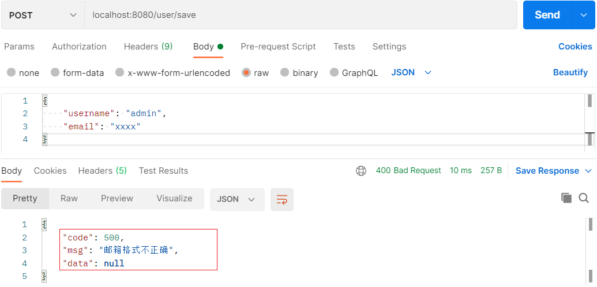

# 3. 集成 Shiro-Redis、Jwt 实现会话共享(二)

```text
blog-tiny
└─src
    └─main
        ├─java
        │  └─org
        │      └─org.myslayers
        │          │ 
        │          ├─common
        │          │  ├─exception
        │          │  │       GlobalExceptionHandler.java.java  # 全局异常
        │          │  │      
        │          │  └─lang
        │          │          Result.java   # 统一封装返回结果
        │          │
        │          ├─config
        │          │      CorsConfig.java.java  # 跨越问题      
        │          │   
        │          ├─entity
        │          │      User.java # 表单校验
        │          │      
        │          ├─shiro
        │          │      JwtFilter.java  # 跨越问题
```

## 3.1 前后端分离：统一封装返回结果

- `Result.java` ：实体类，【前后端分离，统一封装返回结果】

```java
/**
 * 统一封装返回结果
 */
@Data
public class Result implements Serializable {

    // 操作状态：200代表成功，非200为失败/异常
    private int code;

    // 携带msg
    private String msg;

    // 携带data
    private Object data;

    public static Result success(int code, String msg, Object data) {
        Result result = new Result();
        result.code = code;
        result.msg = msg;
        result.data = data;
        return result;
    }

    public static Result success(String msg) {
        return Result.success(200, msg, null);
    }

    public static Result success(String msg, Object data) {
        return Result.success(200, msg, data);
    }

    public static Result fail(int code, String msg, Object data) {
        Result result = new Result();
        result.code = code;
        result.msg = msg;
        result.data = data;
        return result;
    }

    public static Result fail(String msg) {
        return fail(500, msg, null);
    }

    public static Result fail(String msg, Object data) {
        return fail(500, msg, data);
    }
}
```

## 3.2 前后端分离：全局异常

- 默认情况下，返回 Tomcat 或 Nginx 报错页面，对用户不太友好，除此之外，可以根据实际需要对状态码进一步处理。

- `GlobalExceptionHandler.java` ：全局异常，【Shiro 抛出的异常、处理实体校验的异常、处理 Assert 的异常、处理 Runtime 异常】

```java
/**
 * 全局异常
 */
@Slf4j
@RestControllerAdvice
public class GlobalExceptionHandler {

    //ShiroException：Shiro抛出的异常，比如用户权限、用户登录
    @ResponseStatus(HttpStatus.UNAUTHORIZED)
    @ExceptionHandler(value = ShiroException.class)
    public Result handler(ShiroException e) {
        log.error("运行时异常：----------------{}", e);
        return Result.fail(401, e.getMessage(), null);
    }

    //MethodArgumentNotValidException：处理实体校验的异常
    @ResponseStatus(HttpStatus.BAD_REQUEST)
    @ExceptionHandler(value = MethodArgumentNotValidException.class)
    public Result handler(MethodArgumentNotValidException e) {
        log.error("实体校验异常：----------------{}", e);
        BindingResult bindingResult = e.getBindingResult();
        ObjectError objectError = bindingResult.getAllErrors().stream().findFirst().get();

        return Result.fail(objectError.getDefaultMessage());
    }

    //IllegalArgumentException：处理 Assert 的异常
    @ResponseStatus(HttpStatus.BAD_REQUEST)
    @ExceptionHandler(value = IllegalArgumentException.class)
    public Result handler(IllegalArgumentException e) {
        log.error("Assert异常：----------------{}", e);
        return Result.fail(e.getMessage());
    }

    //RuntimeException：处理 Runtime 异常
    @ResponseStatus(HttpStatus.BAD_REQUEST)
    @ExceptionHandler(value = RuntimeException.class)
    public Result handler(RuntimeException e) {
        log.error("运行时异常：----------------{}", e);
        return Result.fail(e.getMessage());
    }

}
```

- `UserController.java` ：控制层，【测试全局异常是否生效，使用 @RequiresAuthentication 注解】

```java
@RestController
@RequestMapping("/user")
public class UserController extends BaseController {

    @RequiresAuthentication //需要用户登录，否则无法访问该接口
    @GetMapping({"", "/", "/index", "/index.html"})
    public Object index() {
        User user = userService.getById(1);
        return Result.success(200, "操作成功！", user);
    }
}
```

- 效果图如下：

## 3.3 前后端分离：表单校验

- 默认提交表单数据时，前端校验可以使用类似于 jQuery Validate 等 js 插件实现，而后端校验可以使用 Hibernate validatior 来做校验。注：SpringBoot 默认集成 Hibernate validatior 校验

- `User.java` ：实体类

```java
@Data
@EqualsAndHashCode(callSuper = true)
@Accessors(chain = true)
@TableName("m_user")
public class User extends BaseEntity {

    private static final long serialVersionUID = 1L;

    /**
     * 用户的【昵称】
     */
    @NotBlank(message = "昵称不能为空")
    private String username;

    /**
     * 用户的【密码】
     */
    @NotBlank(message = "密码不能为空")
    private String password;

    /**
     * 用户的【邮件】
     */
    @NotBlank(message = "邮箱不能为空")
    @Email(message = "邮箱格式不正确")
    private String email;

    /**
     * 用户的【性别】:0代表男，1代表女
     */
    private String gender;

    /**
     * 用户的【头像】
     */
    private String avatar;

    /**
     * 用户的【状态】:0代表登录成功，-1代表登录失败
     */
    private Integer status;

    /**
     * 用户的【近期登陆日期】
     */
    private Date lasted;
}
```

- `Post.java` ：实体类

```java
@Data
@EqualsAndHashCode(callSuper = true)
@Accessors(chain = true)
@TableName("m_post")
public class Post extends BaseEntity {

    private static final long serialVersionUID = 1L;

    /**
     * 文章的【用户ID】
     */
    private Long userId;

    /**
     * 文章的【标题】
     */
    @NotBlank(message = "标题不能为空")
    private String title;

    /**
     * 文章的【描述】
     */
    @NotBlank(message = "描述不能为空")
    private String description;

    /**
     * 文章的【内容】
     */
    @NotBlank(message = "内容不能为空")
    private String content;

    /**
     * 文章的【状态】
     */
    private Integer status;

}
```

- `UserController.java` ：控制层，【测试表单校验是否生效，使用 @Validated 注解】

```java
@RestController
@RequestMapping("/user")
public class UserController extends BaseController {

    @PostMapping("/save")
    public Object testUser(@Validated @RequestBody User user) {
        return user.toString();
    }
}
```

- 效果图如下：

## 3.4 前后端分离：跨域问题

- `CorsConfig.java` ：配置类，【前后端分离，跨域问题】

```java
/**
 * 前后端分离：跨域问题
 */
@Configuration
public class CorsConfig implements WebMvcConfigurer {

    @Override
    public void addCorsMappings(CorsRegistry registry) {
        registry.addMapping("/**")
                .allowedOrigins("*")
                .allowedMethods("GET", "HEAD", "POST", "PUT", "DELETE", "OPTIONS")
                .allowCredentials(true)
                .maxAge(3600)
                .allowedHeaders("*");
    }
}
```

- `JwtFilter.java` ：配置类，【前后端分离，拦截器中加入跨域支持，这样拦截器才不会在进入 Controller 之前就被限制了】

```java
/**
 * Filter：继承 Shiro 内置的 AuthenticatingFilter
 */
@Component
public class JwtFilter extends AuthenticatingFilter {
    
    /**
     * preHandle：拦截器的前置拦截，【前后端项目，除了需要跨域全局配置之外，拦截器中也需要提供跨域支持。这样，拦截器才不会在进入 Controller 之前就被限制了】
     */
    @Override
    protected boolean preHandle(ServletRequest request, ServletResponse response) throws Exception {
        HttpServletRequest httpServletRequest = WebUtils.toHttp(request);
        HttpServletResponse httpServletResponse = WebUtils.toHttp(response);
        httpServletResponse.setHeader("Access-control-Allow-Origin", httpServletRequest.getHeader("Origin"));
        httpServletResponse.setHeader("Access-Control-Allow-Methods", "GET,POST,OPTIONS,PUT,DELETE");
        httpServletResponse.setHeader("Access-Control-Allow-Headers", httpServletRequest.getHeader("Access-Control-Request-Headers"));
        // 跨域时会首先发送一个OPTIONS请求，这里我们给OPTIONS请求直接返回正常状态
        if (httpServletRequest.getMethod().equals(RequestMethod.OPTIONS.name())) {
            httpServletResponse.setStatus(org.springframework.http.HttpStatus.OK.value());
            return false;
        }
        return super.preHandle(request, response);
    }

}
```
